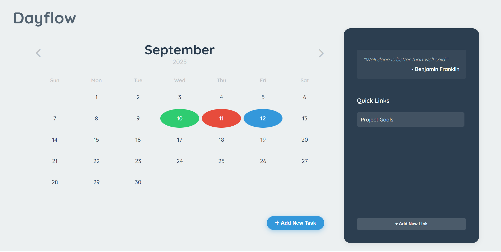

# ☀️ Dayflow

A dynamic and interactive calendar application designed to help you organize your days, manage tasks, and keep important notes, all in one beautiful interface.

---

## ✨ Features

Dayflow is packed with features to make your schedule management seamless and intuitive:

**Interactive Monthly Calendar**: Easily navigate through months and years.
**Dynamic Day Highlighting**:
    * **Blue**: The current day.
    * **Green**: Past days where all tasks were completed.
    * **Red**: Past days with unfinished tasks.
**Daily Task Management**: Click any day to view, add, check off, and delete tasks.
**Daily Notes**: Add multiple, separate notes for any day, accessible via a nested pop-up to maximize task space.
**Repeating Tasks**: Schedule tasks to repeat daily or on specific days of the week.
**Dynamic Quick Links Panel**:
    * Add custom informational links with titles and content.
    * View content in a clean pop-up.
    * Delete links you no longer need via a non-blocking confirmation modal.
**Data Persistence**: All your tasks, notes, and quick links are saved in the browser's `localStorage`, so your data is there when you return.
**Inspirational Quotes**: The information panel displays a rotating quote to keep you motivated.
**Modern Design**: A clean, responsive layout built with modern CSS.

## 🛠️ Tech Stack

This project was built from the ground up using core web technologies:
**HTML5**: For the structure and content.
**CSS3**: For all styling, including Flexbox and Grid for layout, custom variables for theming, and animations for a smooth user experience.
**JavaScript (ES6+)**: For all logic, including date manipulation, DOM interaction, event handling, and data management with `localStorage`.